## Speed up your workflow with voice

Stenox is a native macOS menu bar app that turns your voice into perfectly formatted text. **Speak naturally at 150+ WPM** — Stenox handles transcription, formatting, and insertion automatically.

<CardGroup cols={2}>
  <Card title="Download Stenox" icon="download" href="/installation">
    Install and set up in under 2 minutes.
  </Card>
  <Card title="First Dictation" icon="play" href="/first-dictation">
    Try your first voice-to-text experience.
  </Card>
</CardGroup>

## How Stenox Works

```mermaid
flowchart LR
    A["🎤 Dictate"] --> B["📝 Transcribe"]
    B --> C["✨ Enhance"]
    C --> D["⌨️ Insert"]
```

<Steps>
  <Step title="Dictate">
    Hold your hotkey and speak naturally.
  </Step>
  <Step title="Transcribe">
    WhisperKit (local) or cloud providers convert speech to text.
  </Step>
  <Step title="Enhance">
    AI fixes grammar, formatting, and tone.
  </Step>
  <Step title="Insert">
    Polished text appears at your cursor.
  </Step>
</Steps>

<Note>
  Stenox works in any application — email, chat, code editors, documents, and more.
</Note>

## Why Stenox?

<CardGroup cols={3}>
  <Card title="Privacy First" icon="shield-halved">
    100% local processing available — no internet required.
  </Card>
  <Card title="Smart Profiles" icon="sliders">
    Auto-activate settings per app.
  </Card>
  <Card title="Your Providers" icon="key">
    BYOK for full control over your data.
  </Card>
</CardGroup>

## Get Started Free

Stenox includes a free tier with 5 minutes per day. Combine with BYOK providers for unlimited use.

<CardGroup cols={2}>
  <Card title="100% Local (Free)" icon="lock" href="/providers/local-privacy">
    WhisperKit + MLX — unlimited, private, offline.
  </Card>
  <Card title="Free Cloud Providers" icon="cloud" href="/pricing/free-tier">
    Groq + Gemini — fast and free.
  </Card>
</CardGroup>

## Explore

<CardGroup cols={2}>
  <Card title="Profiles" icon="user-gear" href="/profiles/overview">
    Customize transcription and AI settings per context.
  </Card>
  <Card title="Providers" icon="server" href="/providers/overview">
    Local and cloud options for transcription and AI.
  </Card>
  <Card title="Pricing" icon="credit-card" href="/pricing/overview">
    Free tier, Plus, and Lifetime options.
  </Card>
  <Card title="Setup Guides" icon="gear" href="/setup/license">
    License activation, BYOK, and more.
  </Card>
</CardGroup>

## Need Help?

<CardGroup cols={2}>
  <Card title="Troubleshooting" icon="wrench" href="/guides/troubleshooting">
    Common issues and solutions.
  </Card>
  <Card title="Support" icon="life-ring" href="/support/overview">
    Contact our team — even by voice!
  </Card>
</CardGroup>
